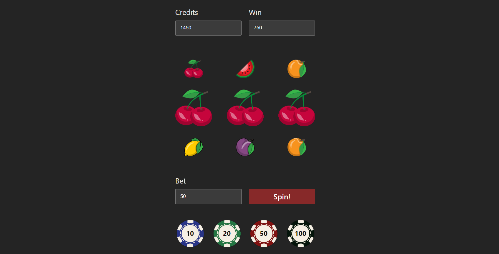

# Slot Machine

### About:
This project is an emulation of a slot machine, featuring various elements with individual probabilities of appearing. Players aim for wins by aligning three identical fruits in a row, with an additional opportunity for a super win by landing three sevens in a row. With the ability to place bets and potentially win rewards, users can enjoy the excitement of playing a classic slot machine game.

### Demo:

### Technologies Used:

### Packages Used:
- [Canvas Confetti](https://www.npmjs.com/package/canvas-confetti)

### Other Links:

- [Icons](https://www.flaticon.com/search?word=slot)

